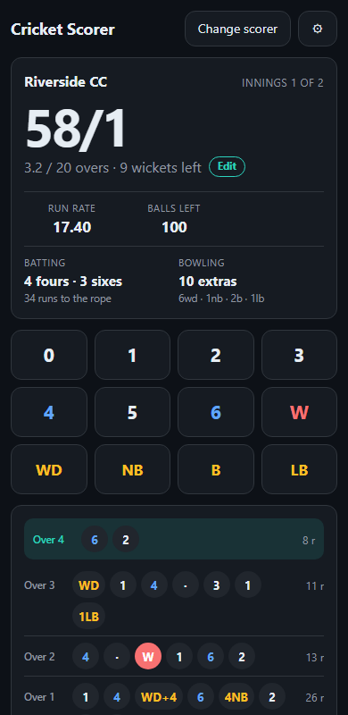

# Cricket Scorer

### ▶ [nanivijay.github.io/cricket-scorer](https://nanivijay.github.io/cricket-scorer/)

A fast, mobile-first, ball-by-ball cricket scorer. Set the match up, then tap your way
through the innings — score, wickets, extras, boundaries, run rate, the over-by-over book,
the chase and the result.

No accounts, no sign-up, nothing to install unless you want to. Add it to your home screen
and it works with no signal at all.



## Features

- **Extras that carry runs.** A wide to the boundary is **5**, not 1. A no-ball hit for
  six is **7**. Byes and leg-byes are separate buttons with their own runs step. Extras
  never consume a ball; byes and leg-byes do.
- **Run outs off any delivery.** Each extras sheet has a red *Run out* row (`W+0 … W+3`)
  beside its runs row. Every button commits exactly what it says, so there is no toggle to
  arm first and no order to get wrong.
- **Any match length.** Any number of overs, any squad size — a side is all out one wicket
  short of its player count.
- **Editable mid-match.** Tap the overs line on the scoreboard (or the ⚙) to change overs,
  players per side, or team names at any point, for a rain-reduced game or a side turning
  up short. It warns you before a change that would end the innings on the spot.
- **Boundaries and extras, attributed.** How many fours and sixes came off the bat, and
  what the bowling side gave away, broken down `6wd · 1nb · 2b · 1lb`. A wide to the rope
  is the bowler's fault, not a boundary, and the app counts it that way.
- **Coin toss.** Pick which side calls, they call heads or tails, the coin lands on **H**
  or **T**, and the winner elects to bat or bowl. Re-toss any time before the match starts,
  skip it entirely, or set who bats first by hand.
- **Two innings with a chase.** Target, "need N from M balls", required run rate, and a
  proper result — by runs, by wickets with balls to spare, or tied.
- **Change scorer.** Mid-match, the whole match packs into a **QR code**; the next scorer
  points a camera at it and picks up from exactly that ball. The link is never shown as
  text, so it cannot be copied out of a screenshot or forwarded by accident — a handover
  happens in person, on purpose.
- **Over-by-over scorebook** with the live over highlighted and per-over run totals.
- **Undo anything**, including back across an over boundary, an innings boundary, or an
  innings you ended by hand.
- **Survives a reload.** The match is saved on every ball, so a locked phone or a closed
  tab loses nothing.

## Running it locally

Any static file server will do — there is nothing to build. A service worker needs
`http://` or `https://`, so opening `index.html` straight off disk works for scoring but
not for offline install.

```sh
python -m http.server 8080
# then open http://localhost:8080
```

## The scoring rules encoded

| Delivery | Runs to the team | Counts as a ball? |
| --- | --- | --- |
| Legal, *n* off the bat | *n* | yes |
| Legal + *n* byes / leg-byes | *n*, all extras | yes |
| Wide | `1 + runs run` (or `1 + 4`), all extras | **no** |
| No-ball | `1` extra `+ n` off the bat | **no** |
| No-ball + byes | `1 + n`, all extras | **no** |
| Wicket on a legal ball | — | yes |
| Run out on a wide / no-ball | runs still count | **no** |

An over ends after six *legal* balls, however many wides intervene. An innings ends when
the overs run out, the last wicket falls, the target is passed, or you end it by hand.

Fours and sixes are counted **off the bat only**: a wide to the rope is five extras and
byes that reach it were never hit, so neither is a boundary — but a four or six off a
no-ball is, because the batter hit it.

## Tests

The scoring laws are the part that has to be right, so they are covered by assertions that
run two ways:

```sh
node tests.js            # scoring laws
node share.tests.js      # handover-link encoding
# or open http://localhost:8080/tests.html for both
```

They pin down every row of the table above, plus over rollover, undo across boundaries,
innings-end conditions, mid-match config changes, boundary and extras counting, and result
wording — and, for handover links, that a match survives the round trip exactly and that a
damaged link is refused rather than quietly decoded into a wrong scorecard.

The QR encoder is verified against a reference implementation rather than by eye — every
module of every matrix, across QR versions 1-32 and all eight mask patterns:

```sh
python -m venv .qrvenv
.qrvenv/Scripts/python -m pip install qrcode
.qrvenv/Scripts/python tools/qr-verify.py
```

## How it is put together

The match is an **append-only log of deliveries**. Score, wickets, overs, extras,
boundaries, run rate, the scorebook and the result are all derived by folding that log
against the current config. Three things fall out of that for free:

- Undo is "drop the last delivery".
- No two statistics can drift apart.
- Changing the overs or the squad size mid-match just re-derives everything, which is
  exactly what a rain-reduced game needs.

`engine.js` holds that fold and knows nothing about the DOM, which is why it can be tested
in Node.

### Files

```
index.html               the whole app — markup, styles, and UI wiring
engine.js                pure scoring functions; no DOM, no dependencies
share.js                 packs a match into a URL fragment, and back
qr.js                    QR encoder: byte mode, level L, versions 1-40
tests.js                 scoring-law assertions (node tests.js)
share.tests.js           handover-link round trips (node share.tests.js)
tests.html               both suites, in a browser
sw.js                    service worker: offline cache
manifest.webmanifest     home-screen install metadata
icon.svg                 source icon
icon-192.png             transparent raster icons, for browser tabs
icon-512.png
icon-maskable-512.png    full-bleed icon, for home screens that crop
tools/make-icons.js      one-off icon generator — not part of any build
tools/qr-verify.py       checks every QR module against a reference encoder
package.json             only `{"type": "module"}`, so `node tests.js` works
```

No bundler, no dependencies, no build step. `package.json` exists solely so Node treats the
test files as modules.

## Handing over, and what it is not

Handing over is a mid-match action only. The result screen offers just **New match** — once
the last ball is bowled there is no scoring left to pass on.

A handover link is a **snapshot**, not a live session. Whoever takes it on continues on
their own copy, and the two diverge from that moment: balls you score afterwards do not
appear for them, and theirs do not appear for you. So hand over and stop, rather than both
scoring at once.

That is the deliberate trade. It needs no server, no accounts and no running costs, and it
works with no signal. The match rides in the URL fragment, which browsers never transmit,
so nothing is uploaded anywhere.

Live shared sessions — one scorer, many watchers, updating ball by ball — would need a
backend. The append-only delivery log is already the right shape for it.

## Deploying

There is nothing to build. Push to `main` and serve the branch root:

**Settings → Pages → Source: Deploy from a branch → `main` / `/ (root)`**

The `.nojekyll` file stops Jekyll touching the assets. Every path in the app is relative,
so it works from a project subpath as happily as from a user root.

## Not included

Per-player batting and bowling figures, strike rotation, dismissal types, fall of wickets,
match history, and live shared sessions. This is a team-level scorer by design — the
delivery log has room for all of it if that changes.
